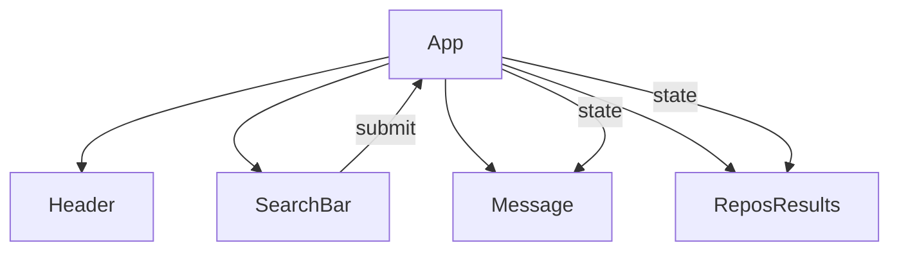

# React GitHub Explorer

**React GitHub Explorer** est une application web monopage (SPA) developpee avec React. Elle permet aux utilisateurs de rechercher des depots sur GitHub via l'API publique, d'afficher les resultats sous forme de cartes, et de naviguer entre differentes pages grace a un systeme de routage.

## Table des matieres

- [Structure des dossiers](#structure-des-dossiers)
- [Composants principaux](#composants-principaux)
- [Routage](#routage)
- [Configuration et build](#configuration-et-build)
- [Exemple d'utilisation](#exemple-dutilisation)
- [Diagramme d'architecture mermaid](#diagramme-darchitecture-mermaid)
- [Extensibilité et Personnalisation](#extensibilité-et-personnalisation)
- [Bonnes pratiques et patterns](#bonnes-pratiques-et-patterns)
- [Démarrage rapide](#démarrage-rapide)
- [Pour aller plus loin](#pour-aller-plus-loin)
- [Configuration environnement](#configuration-environnement)
- [Ressources](#ressources)

---

## Structure des dossiers

- src : Code source principal
  - `components/` : Composants React réutilisables
    - `App/` : Composant racine de l’application
    - `Header/` : Barre de navigation et menu
    - `IndexPage/` : Page d’accueil
    - `Message/` : Affichage des messages d’erreur ou d’information
    - `ReposResults/` : Liste des résultats de recherche
    - `SearchBar/` : Barre de recherche
  - `data/` : Fichiers de données statiques (ex : exemples de dépôts)
  - `styles/` : Fichiers de styles globaux et variables SCSS/CSS
  - `assets/` : Images, polices, favicon, et template HTML
- config : Fichiers de configuration Webpack et chemins
- public : Fichiers publics (robots.txt)
- docs : Documentation et sauvegardes de composants

```md
├── 📁 config/
├── 📁 docs/
├── 📁 public/
├── 📁 src/
│   ├── 📁 assets/
│   ├── 📁 components/
│   │   ├── 📁 App/
│   │   │   ├── 📄 App.js
│   │   │   ├── 🎨 App.scss
│   │   │   └── 🖼️ react-logo.svg
│   │   ├── 📁 Header/
│   │   │   ├── 📄 Header.js
│   │   │   └── 🎨 Header.scss
│   │   ├── 📁 IndexPage/
│   │   │   └── 📄 IndexPage.js
│   │   ├── 📁 Message/
│   │   │   └── 📄 Message.js
│   │   ├── 📁 ReposResults/
│   │   │   ├── 📄 ReposResults.js
│   │   │   └── 🎨 ReposResults.scss
│   │   └── 📁 SearchBar/
│   │       └── 📄 SearchBar.js
│   ├── 📁 data/
│   │   └── 📄 repos.js
│   ├── 📁 styles/
│   │   ├── 🎨 _reset.css
│   │   ├── 🎨 _vars.scss
│   │   └── 🎨 index.scss
│   ├── 📄 index.js
│   └── 📄 vercel.json
├── 📄 .editorconfig
├── 📄 .eslintignore
├── 📄 .eslintrc
├── 🚫 .gitignore
├── 📝 INSTALL.md
├── 📖 README.md
├── 📄 package.json
├── 📄 postcss.config.js
├── 📄 setup-model
├── 📄 updateDeps.js
└── 🔒 yarn.lock
```

## Composants principaux

### App

- **Rôle** : Point d’entrée de l’application, gère le routage et l’état global.
- **Responsabilités** :
  - Initialiser le Router (accueil, FAQ, page d’erreur)
  - Afficher le menu de navigation
  - Propager les props nécessaires aux sous-composants

### SearchBar

- **Rôle** : Champ de recherche pour saisir le nom du dépôt ou le terme à rechercher.
- **Responsabilités** :
  - Gérer le formulaire et le submit
  - Déclencher la requête à l’API GitHub

### ReposResults

- **Rôle** : Afficher les résultats de la recherche sous forme de cartes.
- **Responsabilités** :
  - Trier les dépôts selon le nombre d’étoiles
  - Afficher les informations principales (nom, description, lien, etc.)

### Message

- **Rôle** : Afficher les messages d’erreur, d’information ou de statut.
- **Responsabilités** :
  - Gérer l’affichage conditionnel selon le contexte (erreur API, aucun résultat, etc.)

### Header

- **Rôle** : Barre de navigation pour accéder aux différentes pages.
- **Responsabilités** :
  - Afficher le menu
  - Gérer la navigation entre `/`, `/faq`, et la page d’erreur

---

## Routage

- **Accueil (`/`)** : Barre de recherche + résultats
- **FAQ (`/faq`)** : Questions/réponses sur l’application
- **404** : Page d’erreur pour les routes inconnues

---

## Configuration & Build

- **Webpack** : Configuration modulaire (`common`, `dev`, `prod`) pour gérer le build, le hot-reload et l’optimisation.
- **PostCSS** : Configuration pour la gestion des préfixes et des transformations CSS.
- **Babel** : Transpilation du code ES6+ pour compatibilité navigateurs.

---

## Exemple d’utilisation

```jsx
// src/components/App/App.js
import React from 'react';
import Header from '../Header/Header';
import SearchBar from '../SearchBar/SearchBar';
import ReposResults from '../ReposResults/ReposResults';
import Message from '../Message/Message';

function App() {
  // ...gestion du state et du router...
  return (
    <div>
      <Header />
      <SearchBar />
      <Message />
      <ReposResults />
    </div>
  );
}
```

---

## Diagramme d’architecture (Mermaid)



---

## Extensibilité et Personnalisation

- **Ajout de pages** : Ajouter un composant et une route dans le Router.
- **Personnalisation UI** : Modifier les fichiers SCSS/CSS dans styles ou utiliser d’autres thèmes Semantic-UI.
- **API** : Remplacer ou étendre la logique de requête dans le composant SearchBar pour d’autres endpoints GitHub.

---

## Bonnes pratiques et Patterns

- **Séparation des responsabilités** : Chaque composant a une responsabilité unique.
- **Gestion des erreurs** : Centralisée via le composant Message.
- **Configuration modulaire** : Webpack et Babel configurés pour faciliter le développement et la production.
- **Utilisation de hooks React** : Pour la gestion du state et des effets.

---

## Démarrage rapide

```bash
# Installer les dépendances
npm install

# Lancer le serveur de développement
npm start
```

---

## Pour aller plus loin

- Ajouter l’authentification GitHub pour des recherches personnalisées
- Ajouter des tests unitaires (Jest, React Testing Library)

---

## Configuration environnement

- Node.js >= 14.x recommandé
- Variables d’environnement pour l’API GitHub (si besoin d’un token)
- Voir les fichiers de configuration dans config pour personnaliser le build

---

## Ressources

- [Documentation React](https://react.dev/)
- [API GitHub](https://docs.github.com/en/rest)
- [Semantic UI React](https://react.semantic-ui.com/)

---

## Logique Métier des Composants

### 1. Component Name

SearchBar & ReposResults

### 2. Purpose

Permettre aux utilisateurs de rechercher des dépôts publics sur GitHub et d’afficher les résultats de façon structurée et filtrée.

### 3. Key Responsibilities

- Déclencher une requête à l’API GitHub lors de la soumission du formulaire de recherche.
- Afficher uniquement les dépôts correspondant au terme recherché.
- Trier les résultats selon le nombre d’étoiles (popularité).
- Afficher les informations clés du dépôt (nom, description, lien, etc.).
- Gérer les cas d’absence de résultats ou d’erreur API.

### 4. Workflows / Use Cases

- **Recherche de dépôts** : L’utilisateur saisit un terme, soumet le formulaire, la requête est envoyée à GitHub, les résultats sont affichés sous forme de cartes.
- **Affichage des résultats** : Les dépôts sont triés et présentés immédiatement sous la barre de recherche.
- **Gestion des erreurs** : Si la requête échoue ou ne retourne aucun résultat, un message d’erreur ou d’information est affiché.

### 5. Inputs and Outputs

- **Inputs** : Terme de recherche saisi par l’utilisateur.
- **Outputs** : Liste de dépôts GitHub filtrés et triés, ou message d’erreur/information.

### 6. Dependencies

- API publique GitHub (REST).
- Composants internes : Message (pour l’affichage des erreurs), Header (navigation).

### 7. Business Rules & Constraints

- Les résultats doivent être triés par nombre d’étoiles décroissant.
- Seuls les dépôts publics sont affichés.
- Les erreurs API (limite de requêtes, absence de résultats) doivent être gérées et communiquées à l’utilisateur.

### 8. Design Considerations

- Utilisation de Semantic-UI pour une présentation claire et rapide.
- La logique de tri et de filtrage est côté client pour réactivité.
- Risque : Limite de requêtes imposée par l’API GitHub (rate limiting).
- Edge case : Recherche vide, résultats trop volumineux, absence de connexion internet.

---

## Gestion des Messages et Erreurs

### 1. Component Name

Message

### 2. Purpose

Informer l’utilisateur de l’état de la recherche, des erreurs ou des informations importantes liées à l’utilisation de l’application.

### 3. Key Responsibilities

- Afficher les messages d’erreur lors d’échecs de requête ou d’absence de résultats.
- Afficher les messages d’information (ex : “Aucun dépôt trouvé”).
- Gérer l’affichage conditionnel selon le contexte métier.

### 4. Workflows / Use Cases

- **Erreur API** : Affichage d’un message d’erreur si la requête à GitHub échoue.
- **Aucun résultat** : Affichage d’un message informatif si la recherche ne retourne rien.
- **Succès** : Aucun message ou message de confirmation.

### 5. Inputs and Outputs

- **Inputs** : Statut de la requête, type d’erreur, informations métier.
- **Outputs** : Message affiché à l’utilisateur.

### 6. Dependencies

- Composants de recherche (SearchBar, ReposResults) pour le statut.
- UI Semantic-UI pour la présentation.

### 7. Business Rules & Constraints

- Les messages doivent être clairs, concis et informatifs.
- Les erreurs techniques doivent être traduites en langage utilisateur.

### 8. Design Considerations

- Centralisation de la gestion des messages pour cohérence UX.
- Risque : Multiplication des sources d’erreur, nécessité de prioriser les messages.

---

## Navigation et Routage

### 1. Component Name

Header & Router

### 2. Purpose

Permettre la navigation entre les différentes pages métier de l’application (recherche, FAQ, erreur).

### 3. Key Responsibilities

- Afficher le menu de navigation.
- Gérer le routage entre la page de recherche, la FAQ et la page d’erreur.
- Rediriger l’utilisateur en cas de route inconnue.

### 4. Workflows / Use Cases

- **Navigation** : L’utilisateur clique sur un lien du menu, la page correspondante s’affiche.
- **Erreur de route** : Si l’URL ne correspond à aucune route connue, affichage d’une page d’erreur.

### 5. Inputs and Outputs

- **Inputs** : URL courante, action utilisateur (clic sur le menu).
- **Outputs** : Affichage du composant correspondant à la route.

### 6. Dependencies

- Bibliothèque de routage React (ex : React Router).
- Composants de page (IndexPage, FAQ, Message).

### 7. Business Rules & Constraints

- La page d’accueil doit afficher la barre de recherche et les résultats.
- La FAQ doit être accessible via `/faq`.
- Toute route inconnue doit afficher une page d’erreur.

### 8. Design Considerations

- Simplicité du menu pour une navigation intuitive.
- Risque : Ajout de nouvelles pages nécessite mise à jour du menu et du router.

---

## Configuration et Build

### 1. Component Name

Webpack, Babel, PostCSS (config/)

### 2. Purpose

Assurer la compilation, le bundling et la compatibilité du code pour le déploiement et le développement.

### 3. Key Responsibilities

- Compiler le code source ES6+ en JavaScript compatible navigateurs.
- Gérer les styles CSS/SCSS et les assets.
- Optimiser le build pour la production (minification, splitting).
- Permettre le hot-reload en développement.

### 4. Workflows / Use Cases

- **Build de production** : Compilation et optimisation du code pour déploiement.
- **Développement** : Hot-reload et compilation rapide pour itération.

### 5. Inputs and Outputs

- **Inputs** : Fichiers source JS, SCSS, assets.
- **Outputs** : Bundle optimisé, fichiers statiques prêts à être servis.

### 6. Dependencies

- Webpack, Babel, PostCSS, Semantic-UI.
- Fichiers de configuration personnalisés.

### 7. Business Rules & Constraints

- Le build doit être rapide en développement et optimisé en production.
- Les assets doivent être correctement référencés et chargés.

### 8. Design Considerations

- Modulaire pour faciliter la maintenance et l’extension.
- Risque : Mauvaise configuration peut impacter la performance ou la compatibilité.

---

## **Auteur**

👤 **Yan Berdin**

- Website: [@yanberdin.com](<https://www.yanberdin.com>)
- Github: [@Yan{GitHub}](https://github.com/YanBerdin)
- LinkedIn: [@Yan{LinkedIn}](https://www.linkedin.com/in/yan-berdin)

---

## **Support**

Give a ⭐️ if this project helped you!

---
